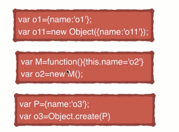
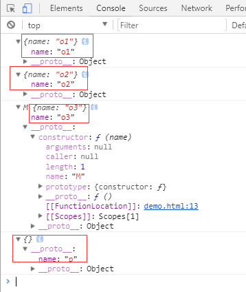
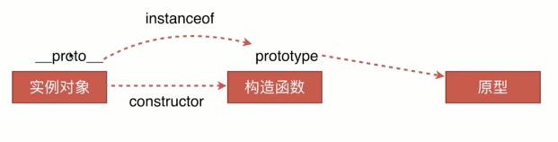
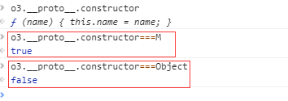

详谈JavaScript原型链

目录
1.创建对象有几种方法
2.原型、构造函数、实例、原型链
3.instanceof的原理
4.new运算符

<!-- more -->

创建对象的方法

　　在了解原型链之前，首先先了解一下创建对象的几种方式，介绍以下三种。

    // 第一种方式：字面量
    var o1 = {name: 'o1'}
    var o2 = new Object({name: 'o2'})
      // 第二种方式：构造函数
    var M = function (name) { this.name = name; }
    var o3 = new M('o3')
      // 第三种方式：Object.create
    var p = {name: 'p'}
    var o4 = Object.create(p)
　　 console.log(o1)　　　　
　　 console.log(o2)
　　 console.log(o3)
　　 console.log(o4)
打印结果:

对象是创建出来了，但你可能对结果很诧异，为什么不同呢？别急，慢慢来。

 原型及原型链

先来一张容易让人懵逼的图

什么是原型对象？实例？构造函数？

概念就不多说了，看代码吧

var M = function (name) { this.name = name; }
var o3 = new M('o3')
 实例就是对象，在本例中o3就是实例，M就是构造函数。
实例通过new一个构造函数生成的。
从上图中可以知道，实例的__protpo__指向的是原型对象。
实例的构造函数的prototype也是指向的原型对象。 
原型对象的construor指向的是构造函数。
 

再来通过下面这个图来理解一下 

那什么是原型链呢？

  简单理解就是原型组成的链，对象的__proto__它的是原型，而原型也是一个对象，也有__proto__属性，原型的__proto__又是原型的原型，就这样可以一直通过__proto__想上找，这就是原型链，当向上找找到Object的原型的时候，这条原型链就算到头了。

原型对象和实例之间有什么作用呢？

通过一个构造函数创建出来的多个实例，如果都要添加一个方法，给每个实例去添加并不是一个明智的选择。这时就该用上原型了。

在实例的原型上添加一个方法，这个原型的所有实例便都有了这个方法。

接着上面的例子继续演示：
var M = function (name) { this.name = name; }
var o3 = new M('o3')
var o5 = new M()
o3.__proto__.say=furnction(){
   console.log('hello world')
}

o3.say()
o5.say()
打印结果

按照JS引擎的分析方式，在访问一个实例的属性的时候，现在实例本身中找，如果没找到就去它的原型中找，还没找到就再往上找，直到找到。这就是原型链。

补充：

只有函数有prototype,对象是没有的。

但是函数也是有__proto__的，因为函数也是对象。函数的__proto__指向的是Function.prototype。

也就是说普通函数是Function这个构造函数的一个实例。

instanceof是判断实例对象的__proto__和生成该实例的构造函数的prototype是不是引用的同一个地址。

是返回true，否返回false。

注意：实例的instanceof在比较的时候，与原型链上想上找的的构造函数相比都是true。

 继续上面的代码
 
 那怎么判断实例是由哪个构造函数生成的呢？这时候就要用到constructor了。

实例的原型的构造函数， obj.__proto__.constructor
 
 new运算符

new运算符的原理

一个新对象被创建。它继承自foo.prototype。
构造函数返回一个对象。在执行的时候，相应的传参会被传入，同时上下文(this)会被指定为这个新的实例。
new foo等同于new foo(), 只能用在不传递任何参数的情况
如果构造函数反悔了一个对象，那个这个对象会取代整个new出来的结果。如果构造函数没有返回对象，那个new出来的结果为步骤1创建的对象。
 下面根据new的工作原理通过代码手动实现一下new运算符
 var new2 = function (func) {
    var o = Object.create(func.prototype); 　　 //创建对象
    var k = func.call(o);　　　　　　　　　　　　　//改变this指向，把结果付给k
    if (typeof k === 'object') {　　　　　　　　　//判断k的类型是不是对象
        return k;　　　　　　　　　　　　　　　　　 //是，返回k
    } else {
        return o;　　　　　　　　　　　　　　　　　 //不是返回返回构造函数的执行结果
    }
}
验证
 
 经过上图一系列折腾，不难看出，我们手动编写的new2和new运算符的作用是一样的。

通过这个例子，你是不是已经熟知了new的工作原理了呢